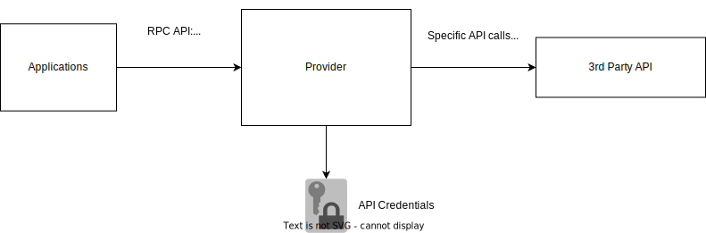

# Provider Development Kit

Provider Development Kit for Python.

## What is a provider?

A Provider is a Python service which provides a consistent API for managing fine-grain permissions.

Managing permissions in cloud providers, SaaS applications, and CI/CD platforms usually requires access to highly sensitive secrets, like administrative API tokens. The Provider framework allows for access to be granted and revoked to these platforms without requiring direct access to these tokens:



## What does the Provider Development Kit do?

The Provider Development Kit (PDK) makes it easy to develop and deploy Providers.

```python
class Provider(provider.Provider):
    api_url = provider.String()

@access.target()
class Target:
    ...

@access.grant()
def grant(p: Provider, subject: str, target: Target):
    # perform API calls here to grant access
    ...

@access.revoke()
def revoke(p: Provider, subject: str, target: Target):
    # perform API calls here to revoke access
    ...
```

The PDK handles configuration and packaging into a cloud-native function which can be executed by an application.

## Supported runtimes

Currently the supported runtimes for Providers are as follows:

- AWS Lambda

## Provider Schemas

Each Provider has a strongly-typed schema. An example schema is shown below:

```json
{
  "audit": {
    "resourceLoaders": {},
    "resources": {}
  },
  "config": {},
  "target": {
    "MyTarget": {
      "schema": {
        "first": {
          "description": "first var",
          "id": "first",
          "resourceName": null,
          "title": "First",
          "type": "string"
        }
      }
    }
  }
}
```

The schema is based on [JSON Schema](https://json-schema.org/) and allows applications using Providers to interpret the available resources and display the appropriate UI.

## Applications using the Provider Framework

- [Common Fate](https://github.com/common-fate/common-fate)
